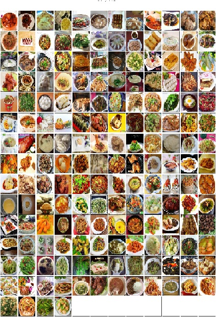
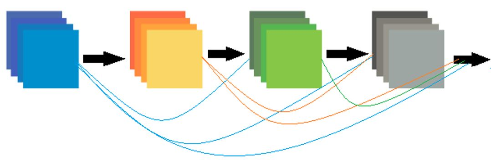

# denseFood: Food Recognition Based on Densely Connected Convolutional Networks

<h1> Introduction </h1>

In the latest years, there is dramatic consideration on using technology in many fields especially when we use the artificial intelligence to make our life easy. Due to the increase using of computer vision technology in many domains like surveillance cameras, healthcare, etc.. Food recognition is one of these important fields and deserves more research efforts because of its practical importance and scientific challenges

Recently, Convolutional Neural Network (CNN) is used in the context of food recognition. Food recognition methods uses CNN models to extract food image features, compute the similarity of food image features and use classification techniques to train the classifier to accomplish food recognition.

<h1>Proposed Method</h1>

The proposed model presented called DenseFood, which is based on DenseNet architecture

<h1>Experiment</h1>

Let's to divide the dataset into two sub dataset for training and testing by run this script

<pre>$ python build_datse_food.py --data_dir  --output_dir</pre>

--data_dir refers to the source dataset folder

--output_dir refers to the output folder to split dataset into

<h3> Training  </h3>

We will train our model by run the script as below. we need to choose which model we will use to train by specievied the --model_dir that contain the params.json

<pre>
$ python train.py --data_dir food172 --model_dir experiments/densefood
</pre>

 Food Evaluation.ipynb file contain a code for data visualization
